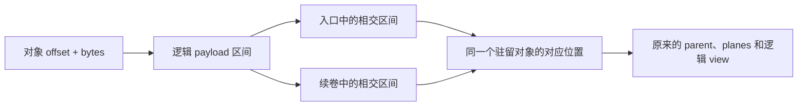

# NInfer v3 容器规范

V3 保存精简的模型实例配置、实际对象、逻辑绑定与所需资源。数学公式、组件交接和状态程序
由模型代码定义。Reader 与 writer 根据本文即可独立实现文件组织和引用；
对应架构的 binder 再解释逻辑参数与配置。

一个 artifact 有固定入口和一份总目录。较小时是一个 `.ninfer` 文件，较大时由入口加续卷组成。
对象使用统一的逻辑 payload 偏移，文件分片保持每个对象的编码、布局和绑定关系。

## 1. 合同与记法

| 内容 | 权威 |
|---|---|
| 文件头、JSON、对象与引用、文件分片、v3 持久名称 | 本文 |
| 固定数学、精简 config、逻辑参数 shape、组件输入 | 对应架构的[配置](../../src/models/qwen3_5/config.h)与[绑定](../../src/models/qwen3_5/load/) |
| Format 的数值解码、有效 codes/scales | [数值格式](tensor-formats.md)；持久名称见第 6 节 |
| Layout 的 planes、packing、内部 padding 与 encoded size | [存储布局](storage-layouts.md)；持久名称见第 6 节 |
| 原生 Op 参数、支持范围、数值与 scratch | 对应 Op 合同 |
| 驻留、状态、容量、CUDA Graph 和结果发布 | [Engine 架构](engine-architecture.md)及其资源合同 |

本文的整数均为精确整数，布尔值和浮点值分别按各自类型解释。

| 记法 | 定义 |
|---|---|
| U64 | `0..18446744073709551615` 的整数 |
| PositiveU64 | 严格大于零的 U64 |
| ID | 非空 UTF-8 字符串，不含 U+0000，按原字符序列精确比较 |
| Shape | 长度 `0..16` 的正整数列表；空列表 `[]` 表示一个 scalar |
| `elements(shape)` | 空 shape 为 1，其余为维度乘积 |
| `[begin,end)` | 左闭右开的区间 |
| `align_up(x,a)` | `ceil_div(x,a)*a` |

乘积、前缀和、偏移加法与对齐结果须处于 U64 范围内。实际 I/O 和内存消费者检查自己的
地址范围。文件格式使用 64 位尺寸，Op 的实际 shape 支持由其调用入口决定。

Header 整数采用 little-endian。JSON 使用 UTF-8，每个对象的成员名唯一。成员顺序、普通
字符串转义和 JSON 空白保持标准 JSON 含义。尺寸字段采用 JSON 整数，模型实数参数按其合同
要求的精度保存和解析。

字段表列出通用记录的完整成员集合及可选性。未列出的通用字段是 schema 错误；
`config` 交给架构解释，`metadata` 和 `provenance` 是第 10 节定义的开放资料对象。

## 2. 文件集合与地址空间

### 2.1 入口与续卷

Writer 根据指定的入口输出路径生成文件集合。入口为 `example.ninfer` 时，文件名统一为：

```text
example.ninfer
example.ninfer.part-0001
example.ninfer.part-0002
```

入口保存 header、JSON 总目录及第一段 payload。每个续卷保存自己的小 header 与后续 payload。
Writer 将续卷命名为 `<入口文件名>.part-<序号>`，入口文件名包含原扩展名；序号等于该续卷在
`files` 表中的下标，从 1 开始，以十进制表示，不足四位时左侧补零至四位，四位及以上完整输出。
续卷名由此规则自动派生，无独立命名参数；实际文件名写入 `files[i].path`。

用户始终打开入口。Reader 按 `files` 表记录的文件名定位续卷；上述生成命名规则不作为读取
校验条件，目录中满足第 3.3 节路径规则的文件名均可读取。

同一组文件具有相同的 16-byte `artifact_id`。它用于核对入口与续卷的归属，建议 writer 每次
生成新的文件集合时使用新的 UUID。它是容器集合标识，模型实现选择仍依据架构和实例参数。
Header 中保存原始 16 字节；打印时可用 32 个小写十六进制字符表示。

### 2.2 逻辑 payload

令 `files[i].payload_bytes = B_i`，定义：

```text
P_0 = 0
P_i = sum(B_j, j < i)
payload_bytes = sum(B_i)
```

文件 i 保存逻辑 payload 的 `[P_i,P_i+B_i)`。这是一组有序、连续的区间。
对象的 `offset` 始终相对于这个逻辑 payload；各文件的 header、JSON 和 payload 前的对齐区
均不计入逻辑 payload。



对象可以跨越文件边界。它仍是一个对象，其 format/layout 以完整对象的逻辑起点计算。
分片边界也可以位于某个 plane 内部；读取与复制保持原始字节顺序。

### 2.3 默认 32 GB 分片上限

Writer 默认采用 **32 GB = 32,000,000,000 字节**的单文件大小上限，计入文件头、JSON、
payload 前的对齐区和该文件的 payload。这里 GB 使用十进制单位。

Writer 可接受其他显式上限。上限是生成策略，文件中只保存实际分片结果，reader 按目录读取。
若 `entry_payload_start + payload_bytes <= limit`，writer 只生成入口文件。
超过上限时，入口先容纳第一段，剩余数据依次进入续卷。

对给定的 entry_payload_start，当前 writer 的分片容量为：

```text
entry_capacity = floor((limit - entry_payload_start) / 4096) * 4096
part_capacity  = floor((limit - 4096) / 4096) * 4096
```

需要分片时，先检查上限足以容纳头部且两种容量均为正；非末段按容量写满，末段写剩余字节。
分片数量由数据量和容量决定。
这种放置使各段的逻辑起点保持 4096-byte 对齐，便于 direct I/O；reader 的范围映射也接受
其他满足本规范的正长度分段。

## 3. 二进制 framing

### 3.1 入口 header

入口 header 长度固定为 32 字节。

| Offset | Bytes | 字段 | 编码与含义 |
|---:|---:|---|---|
| 0 | 8 | magic | `4e 49 4e 46 45 52 00 03`，即 `NINFER`、零字节、版本 3 |
| 8 | 8 | json_bytes | Little-endian PositiveU64；完整 UTF-8 JSON 文本长度 |
| 16 | 16 | artifact_id | 文件集合标识的原始字节 |

```text
json_offset         = 32
metadata_end        = 32 + json_bytes
entry_payload_start = align_up(metadata_end, 4096)
entry_file_bytes    = entry_payload_start + files[0].payload_bytes
```

Reader 核对完整 magic，读取 `[32,metadata_end)` 的 JSON，并检查实际文件长度等于
entry_file_bytes。`[metadata_end,entry_payload_start)` 是文件对齐区，writer 写零。

JSON 的合法尾部空白计入 json_bytes。Writer 可以用它预留确定的目录空间，再安排入口中的
payload 容量；这避免分片表长度变化反复移动 payload。Reader 按标准 JSON 解析这段文本。

### 3.2 续卷 header

续卷 header 同样为 32 字节，payload 固定从文件 offset 4096 开始。

| Offset | Bytes | 字段 | 编码与含义 |
|---:|---:|---|---|
| 0 | 8 | magic | `4e 49 4e 50 52 54 00 03`，即 `NINPRT`、零字节、版本 3 |
| 8 | 8 | part_index | Little-endian PositiveU64；对应 `files` 数组下标 |
| 16 | 16 | artifact_id | 与入口逐字节相同 |

```text
part_payload_start = 4096
part_file_bytes    = 4096 + files[part_index].payload_bytes
```

Writer 将 `[32,4096)` 写零。Reader 打开续卷时核对 magic、part_index、artifact_id 和实际长度。
入口与续卷有不同 magic；一个续卷通过入口目录参与读取。

### 3.3 文件目录

根字段 `files` 是非空数组。数组第 0 项描述入口，其余项描述续卷。

| 字段 | 类型 | 含义 |
|---|---|---|
| path | 第 0 项为 null；其余为字符串 | 相对于入口目录的同级文件名 |
| payload_bytes | PositiveU64 | 该文件保存的逻辑 payload 字节数 |

```json
[
  {"path": null, "payload_bytes": 31999934464},
  {"path": "example.ninfer.part-0001", "payload_bytes": 4096}
]
```

续卷 path 是一个非空文件名，采用原字符序列；其中不含 `/`、`\\` 或 U+0000，名称也不等于
`.` 或 `..`。续卷文件名互不重复，且与本次打开的入口文件名不同。目录可以整体移动。

上面的数值示例取 entry_payload_start=65536，因此入口文件恰好为 32,000,000,000 字节。
第二个文件的实际大小为 8192 字节。

## 4. JSON 总目录

### 4.1 根记录

| 字段 | 类型 / 必需性 | 含义 |
|---|---|---|
| components | Object，必需且含 text | 实际提供的模型组件及精简配置 |
| objects | 非空 Array<ObjectDescriptor>，必需 | 按逻辑 payload offset 排列的物理对象 |
| bindings | Object，必需 | 完整逻辑参数名到 Binding 的映射 |
| uses | Array<Use>，必需 | 按数学使用位置展开的计算许可与辅助输入 |
| files | 非空 Array<File>，必需 | 第 3.3 节文件目录 |
| metadata | Object，可选 | 公开名称等第 10 节资料 |
| provenance | Object，可选 | 来源、训练配对与转换说明 |

Framing 版本已经确定 JSON 语法，根记录直接使用上述字段。完整的 JSON 示例见第 12 节。

### 4.2 组件记录

`components` 的键是组件 ID。`text` 是主模型；当前可选组件使用 `vision`、`mtp`、`dflash`、
`dflash2`。新的实际架构或后端可以使用同一记录结构，由对应编译代码解释其 ID 和 config。

| 字段 | 类型 / 必需性 | 含义 |
|---|---|---|
| config | Object，必需 | 架构标识与本组件的少量实例参数 |
| target | 组件 ID，可选 | 本组件所关联的目标组件 |
| resources | Object，可选 | 资源角色到 resource 对象 ID 的映射，省略表示空映射 |
| proposal | Object，可选，仅 text | 主模型所附的可选 proposal 输出表示，见第 9.2 节 |

Config 使用对应架构的标准 architectures/model_type 与保留字段。
例如 Qwen Text 包含 architectures、model_type、hidden_size 等；Vision 使用自己的标准
model_type；当前 Qwen MTP 的 config 只需 architectures，几何通过 target 取得。
源适配解释上游 `text_config`、`vision_config` 等组织，再把规范化结果写入对应组件的 config；
组件的 target、resources 和 proposal 按本节字段表单独放置。

```json
{
  "config": {"architectures": ["Qwen3_5MTP"]},
  "target": "text"
}
```

Target 引用须能找到对应组件，其数学关联由架构 binder 检查。当前 Vision 与 spec 的 target
均为 text。固定特征采集位置、状态操作和功能准备流程由该组件代码定义。

组件声明表示产物提供它。启动选项决定本次启用的组件；text、所选组件及其实际共享数据参与
加载。Writer 对所声明组件的数据完整性负责，binder 对启动所选功能检查数学与数据需求。

## 5. 物理对象

### 5.1 Tensor 对象

| 字段 | 类型 | 含义 |
|---|---|---|
| id | ID | 本 artifact 内唯一的对象引用名 |
| kind | `tensor` | 对象类别 |
| shape | Shape | 存储对象的逻辑 shape，采用 C-order 元素坐标 |
| format | ID | 第 6 节的数值格式 |
| layout | ID | 第 6 节的布局 |
| offset | U64 | 对象起点在逻辑 payload 中的字节偏移 |
| bytes | PositiveU64 | 该对象完整编码的字节数 |

```json
{
  "id": "w.attn.qk",
  "kind": "tensor",
  "shape": [7168, 5120],
  "format": "q4_g64_fp16",
  "layout": "row_split_k128_v1",
  "offset": 0,
  "bytes": 19496960
}
```

Shape 描述对象的逻辑值域；layout 自己计算物理 padding、planes 和 encoded size。
例如 Q4 的 K 维 padding 由 row_split_k128_v1 计算。对象可以容纳多个投影或多个专家，
其数学用途由第 7 节绑定给出。

一个已编码对象包含其 codec/layout 要求的全部 planes 和对象级标量。现有 NVFP4 的 block
scales 与 weight divisor 在对象内；现有逐行 FP8 的 row scales 也在对象内。
Op 所需的独立指针从这个对象的既定布局取得。使用位置的 activation divisor 则单独绑定，见第 8 节。

### 5.2 Resource 对象

| 字段 | 类型 | 含义 |
|---|---|---|
| id | ID | 与所有 tensor/resource 对象共用唯一命名空间 |
| kind | `resource` | 对象类别 |
| encoding | `raw_bytes_v1` | 完整区间为原始资源字节 |
| offset | U64 | 逻辑 payload 字节偏移 |
| bytes | PositiveU64 | 原始资源长度 |

```json
{
  "id": "r.chat_template",
  "kind": "resource",
  "encoding": "raw_bytes_v1",
  "offset": 19496960,
  "bytes": 4096
}
```

资源解释由其使用角色决定。Json、UTF-8 模板或其他资源的内容规则属于相应 Frontend；
resource 对象自身只提供原始字节。

### 5.3 对象范围与共享

所有对象按 offset 递增排列，ID 唯一，字节区间互不重叠且位于逻辑 payload 内。
Tensor offset 满足 layout 的 256-byte 对象对齐，raw resource 的对齐为 1。
Tensor bytes 等于对应 `(format,layout,shape)` 的 encoded size。

对象间隙和末尾未引用的逻辑 payload 字节没有加载语义。常规 writer 只为对齐留空，并在最后
一个对象结束处截断。完整编码对象内部的 padding 继续遵循其 layout 合同。

多个逻辑用途共享同一个对象时都引用同一 ID；materializer 据此建立一次 backing。
没有被本次用途引用的对象保持未驻留。对象 ID、排列和文件位置只参与加载与诊断，执行中的
权重引用由 binder 一次性解析。

完整 parent 是物化与驻留单位。Converter 必须将主干参数、各可独立启用组件的私有参数及
可独立选择的 proposal 表示的私有数据分别组织为对象，使关闭功能的私有数据保持未驻留。
真正共享的数据可以由不同功能引用同一对象，例如 Text 与 MTP 使用同一 embedding/head，
或 proposal 引用 Text head 的已有表示。
将 Text 参数与 MTP 私有投影拼进同一 parent 不符合这条生成规则；将它们的独立对象放在
同一文件中则符合规则。Converter 按架构的功能依赖检查对象合并边界，reader 继续按目录读取。

## 6. V3 数值格式与布局名称

### 6.1 数值格式

V3 的规范名字采用小写 snake_case。每个名字指向代码中一个具有精确含义的 codec；固定的
group size、scale 类型和解码规则直接由该 codec 定义。

| 名称 | 数值含义 |
|---|---|
| bf16 | Bfloat16 原始 word |
| fp32 | IEEE binary32 原始 word |
| int32 | 有符号 32-bit 整数 |
| q4_g64_fp16 | Signed 4-bit codes，G64，FP16 multiplier |
| q5_g64_fp16 | Signed 5-bit codes，G64，FP16 multiplier |
| q6_g64_fp16 | Signed 6-bit codes，G64，FP16 multiplier |
| q8_g32_fp16 | Codes `[-127,127]`，G32，FP16 multiplier |
| t2_g128_fp16 | Ternary codes `[-1,1]`，2-bit two's complement，G128，FP16 multiplier |
| nvfp4 | E2M1 codes、G16 E4M3FN block scale、FP32 weight divisor |
| fp8_e4m3fn_row_bf16 | E4M3FN codes，每行一个 BF16 multiplier |

量化名字末尾的 FP16/BF16 表示 scale 类型。激活计算许可在 uses 中表达。
Code 范围、特殊浮点值、舍入与精确重建按[数值合同](tensor-formats.md)解释。
尤其是 NVFP4 的重建采用 `code_value * block_scale / weight_divisor`，逐行 FP8 采用其既定的
`code_value * row_scale` 重建规则。

同一数值含义更换 encoder 或校准过程时，format 名保持相同，生成方法记录在 recipe/provenance。

### 6.2 布局与资源编码

| 名称 | 当前允许的 format / shape | 对象对齐 |
|---|---|---:|
| contiguous_le_v1 | bf16/fp32/int32，rank 0..16 | 256 |
| row_split_k128_v1 | q4_g64_fp16、q5_g64_fp16、q6_g64_fp16、q8_g32_fp16、t2_g128_fp16，正 rank-2 `[N,K]` | 256 |
| block_scale_k16_m128x4_v1 | nvfp4，`N%128=0`、`K%64=0` | 256 |
| row_scale_v1 | fp8_e4m3fn_row_bf16，正 rank-2 `[N,K]` | 256 |
| raw_bytes_v1 | Resource，非空字节串 | 1 |

Byte packing、planes、内部 padding、swizzle 和 encoded-size 公式由
[存储布局合同](storage-layouts.md)定义。

Layout 的 v1 是布局自身的版本，与容器 v3 分别管理。增加不同的字节排列时增加对应 layout
定义；增加实际数值编码能力时增加 codec 定义，普通对象记录继续使用同一结构。

## 7. 逻辑参数绑定

### 7.1 两种 Binding

根 `bindings` 是完整逻辑参数名到 Binding 的映射。名字由架构代码定义，例如
`text/layers/3/attention/query`。逻辑参数 shape 由代码和精简 config 推导。
每个逻辑名字对应一份 Binding。架构为需要独立表示的训练参数用途定义不同逻辑名字，
各 Binding 可引用同一对象或不同对象，训练共享关系由架构/config 定义。

Binding 有两种互斥形式：

| 形式 | 完整字段 | 含义 |
|---|---|---|
| 整对象 | `object: ID` | 整个 tensor 对象对应一个逻辑参数；object.shape 等于参数 shape |
| 有序片段 | `parts: 非空 Array<Part>` | 依次连接各片段的逻辑元素，覆盖该参数的 C-order 元素序列 |

Part 的完整字段为：

| 字段 | 类型 | 含义 |
|---|---|---|
| object | Tensor 对象 ID | 片段的物理 parent |
| range | `[U64,U64]` | 对象逻辑元素的扁平区间 `[begin,end)` |

Range 满足 `0<=begin<end<=elements(object.shape)`。各片段的元素数之和等于逻辑参数的元素数。
数组顺序就是目标元素顺序；target offset 由前面的片段长度累加得到。
同一对象的区间可以被不同用途或不同片段引用，实际重复含义由对应模型数学解释。

```json
{
  "text/final_norm": {"object": "w.final_norm"},
  "text/layers/3/attention/query": {
    "parts": [{"object": "w.attn.qk", "range": [0, 31457280]}]
  }
}
```

**Range 的单位是逻辑元素，object.offset/bytes 的单位是字节。** 逻辑元素序列排除 layout
引入的 padding，也不把 quantization scales 当作权重元素。它保持 parent 的数值解码规则。

### 7.2 轴、reshape 与行顺序

C-order 表示最后一维变化最快。对 shape `[N,K]`，元素坐标 `(n,k)` 对应 `n*K+k`。
连续完整行 `[r0,r1)` 因而对应 range `[r0*K,r1*K)`。

整对象形式表达相同 shape 的完整绑定。有序片段形式按明确的元素对应解释目标 shape，
可以表达连续 reshape、融合 parent 的子区域、拆分对象以及行块重排。
例如 rank-2 expert bank 的某个 expert 区间可以对应一个 rank-2 逻辑投影；更高阶逻辑轴由
该参数自己的 shape 解释。

若 parent 交错存放两组投影，converter 可以为每个 head 的连续区域依次写出 Part。
常规产物优先在转换时准备已有 Op 易于消费的 grouping 与行序。

### 7.3 绑定到原生 Op

Binder 检查逻辑覆盖和对应关系，并保留每个 Part 的 parent、原始 shape、format/layout、
范围和 owner。一个逻辑参数可以由多个表示组成；一个原生 Op 也可以消费多个逻辑参数。

例如 Q/K 与 gate/V 分别来自 q4、q5 parent 时，参数准备可以进入已实现的双权重入口；四者
来自同一个 nvfp4 parent 时，可以进入对应单权重入口。代码根据真实 grouping、范围和几何
组织这些调用。

Zero-copy view 由实际 layout 与 consumer 的寻址能力决定。RowSplit 的一段逻辑行涉及 base、
可选 high-bit 和 scale 等多个 plane 区间；NVFP4 的 view 还保留原 parent 的 scale swizzle 与
weight divisor。Materializer 上传 parent 的原始编码，Op 准备其真实可消费的 view。
需要改变 packing 或重新组织编码的工作由 converter 完成。

文件分片只影响 parent 字节的获取。即使一个 parent 跨多个文件，以上逻辑引用和 Op 参数关系
仍然成立。

## 8. 使用许可与辅助输入

根 `uses` 是 Use 数组，每个 `(parameter,input)` 组合唯一。
每个 Use 消费其 parameter 指向的那份 Binding；同一 parameter 的多个 Use 共用这份表示，
分别提供各自输入位置上的许可与辅助值。

| 字段 | 类型 / 必需性 | 含义 |
|---|---|---|
| parameter | ID，必需 | 已存在的根 bindings 逻辑参数名 |
| input | ID，必需 | 架构代码定义的完整数学输入位置 |
| activation_policy | 枚举，可选 | 对具有该许可合同的用途必需 |
| auxiliaries | Object，可选 | 辅助输入角色到 Binding 的映射，省略为空 |

许可的精确拼写及允许集合为：

| activation_policy | 允许集合 |
|---|---|
| A16Only | A16 |
| AllowA8 | A16、A8 |
| AllowA4 | A16、A8、A4 |

Writer 为需要许可的 projection 使用位置写出明确结果。某个 encoder 的默认规则属于 recipe，
进入 uses 后已经展开。共享一次激活量化时采用相关用途许可的交集，并满足辅助输入关系。

```json
{
  "parameter": "text/layers/3/attention/query",
  "input": "text/layers/3/mixer_input",
  "activation_policy": "AllowA4",
  "auxiliaries": {
    "activation_input_divisor": {"object": "a.attn.query.input_divisor"}
  }
}
```

该例的辅助对象为 `format=fp32, layout=contiguous_le_v1, shape=[]`，其数值按 consumer 要求
检查为正且有限。也可用 Part 引用一个 FP32 向量中的单个元素，保留相同 scalar 含义。
Auxiliary Binding 的期望 shape、类型和作用由对应使用合同定义。

`hadamard_signs` 标记 Hadamard 旋转的矩阵：Binding 为 `format=bf16, layout=contiguous_le_v1,
shape=[K]`，K 为该 parameter 的输入宽度且是 1024 的倍数，元素为 +1 或 -1。该用途把存储的矩阵
乘以 `hadamard_transform(input, signs)`（每个 1024 块先逐元素乘符号，再做归一化 Sylvester
Walsh-Hadamard 变换）而不是原始输入。同一向量可被任意多个用途引用，loader 只绑定一次。
执行层只在支持旋转的输入位置接受它；其余位置遇到该辅助输入时拒绝加载。

```json
{
  "parameter": "text/layers/0/mlp/down",
  "input": "text/layers/0/mlp/product",
  "activation_policy": "A16Only",
  "auxiliaries": {"hadamard_signs": {"object": "w.hadamard.signs_17408"}}
}
```

DFlash/DFlash2 的 query K/V 使用 `attention/key`、`attention/value`，context K/V 使用
`attention/context_key`、`attention/context_value`，各自建立 Binding 和 Use。
两组绑定可以共享 parent 区域，也可以独立选择表示，见第 12.5 节。
Weight divisor 和 block scales 属于权重 codec，activation divisor 属于该使用位置。

## 9. 资源与可选输出表示

### 9.1 Frontend 资源引用

组件的 resources 键由对应 Frontend 合同解释，常用上游文件角色可以直接使用原文件名：

```json
{
  "tokenizer.json": "r.tokenizer",
  "tokenizer_config.json": "r.tokenizer_config",
  "chat_template.jinja": "r.chat_template",
  "generation_config.json": "r.generation_config"
}
```

这些值全部引用 resource 对象。它们是对象引用，实际资源字节随 artifact 保存。
Vision 的 processor 资源可放在 vision.resources 中，启用功能时按依赖取得。

V3 可以在相应资源对象中承载自定义 chat template。资源保存原始字节，模板的识别与渲染由
当前 [Frontend](../../src/models/qwen3_5/frontend/chat_template.cpp) 的实际能力决定。
完整 tokenizer 资源共同决定 token 域，固定模型 config 保留自己的权重 vocab_size。

### 9.2 可选 proposal 输出表示

`text.proposal` 的完整记录为：

| 字段 | 类型 / 条件 | 含义 |
|---|---|---|
| domain | `full` 或 `indexed` | Proposal 行域 |
| rows | PositiveU64，仅 indexed | Ns；indexed head 的逻辑行数 |

其参数仍放在根 bindings 中，使用已定义的 `proposal/head` 与 `proposal/token_ids` 名字。
Full 的行数从 Text vocab_size 取得；indexed 需要显式 token ID 映射。主输出 head 始终由
Text 自己的绑定提供。省略 proposal 时，现有后端按其代码使用 target 的完整输出表示。

## 10. 实例资料与 provenance

`metadata` 是开放 JSON 对象，可选 `name` 为非空公开名称字符串，其余成员供展示和工具记录。
`provenance` 是开放 JSON 对象，可保存源 checkpoint/revision、组件训练配对、encoder/recipe
说明和转换信息。两者省略时按空对象处理。

执行所需的数值、许可和资源分别进入 config、对象、bindings、uses 和 resources。
Frontend 从 generation_config 读取 EOS；模式采样预置由架构实现提供，应用及请求可以覆盖。
资源中的采样数值原样保存，当前 Frontend 不用它们替换模式预置，见[CLI 采样说明](../cli.md)。
Provenance 说明训练配对的来源，binder 检查组件的实际 target、维度和输入关系；质量与接受率
由产物评估建立。

Artifact_id 用于核对分片集合，公开名称用于产品语义，架构/config 用于取得固定模型实现，
对象绑定用于提供实际表示。各消费者按这些用途读取数据。

## 11. 读取、写入与错误边界

### 11.1 Generic reader

Reader 首先读取入口 header 和 JSON，完成以下结构检查：

1. Framing、字段集合、类型、唯一成员与整数范围。
2. Files 的顺序、路径、正长度与逻辑前缀和；入口实际长度。
3. 对象 ID、shape、字节范围、顺序和互不重叠。
4. Binding/Use/resource/target 引用存在，引用的对象类别正确，Part 范围合法。

Reader 可以保留尚未解释的架构 config 和 format/layout 名称供 inspection。
需要读取某个 tensor 时，通用 codec/layout 设施解析其格式，核对 encoded size 与对齐；
所选资源按 encoding 读取。未知的编码在实际请求解释该对象时报告。

完整分发包含目录声明的全部文件。一次运行只打开所选对象涉及的文件；其余续卷可以保持未获取。
需要的任何一段缺失、header 归属错误或长度不符时，相关读取失败。
组件关闭时按所选需求决定读取范围，同一文件中的其他对象保持未上传。

### 11.2 范围读取与 materialization

对逻辑读取 `[offset,offset+length)`，依次取它与每个文件 payload 区间的交集。
读取范围须完整落在 `[0,payload_bytes)` 内；length=0 时允许 offset 位于末端并返回空结果。
范围读取必须取得声明的全部字节，声明区间内提前 EOF 或 I/O 失败按读取错误处理。
若交集为 `[a,b)`，对应读取为：

```text
source_file_offset = file_payload_start(i) + (a - P_i)
destination_offset = a - offset
copy_bytes          = b - a
```

I/O 层可将这些段继续切成传输块，按原偏移写入同一个目标对象。File header 和文件对齐区
不参与复制；跨文件数据通过上述范围映射交给 materializer。

Materializer 按实际使用的 parent 去重，安排 device/host backing，再取得 typed view。
辅助 scalar、索引等需要 owning Host 值的用途可以按 Binding 读取对应元素区间，保持其数值类型。
Reader 的 JSON 与符号索引用于冷加载，运行时使用解析后的引用与直接调用。

### 11.3 语义与支持检查

| 情况 | 所有者 |
|---|---|
| Header、目录、引用、范围错误 | Generic reader |
| Format/layout 的编码几何、实际文件缺失或不匹配 | 对象读取与 materialization |
| 精简配置、逻辑参数 shape/覆盖、组件关系、所选功能数据缺失 | 对应架构 binder |
| Codes/scales、编码 padding 与源数值转换正确性 | Converter、codec 与相应验证 |
| 实际原生参数、format/layout/shape/phase 支持不足 | Op 准备、容量查询、warmup 或执行 |
| 状态存储、实际容量与生命周期 | Program 与状态实现 |

运行时沿实际消费者完成必要检查，使用已转换的 payload；常规上传依赖 producer 建立的
codes/scales 合同。数值资格验证按现有 Op/codec 规则执行。
Warmup 的结论覆盖实际执行路径，失败 round 按既有状态事务处理。

### 11.4 Writer

Writer 接收已经确定的组件配置、对象/绑定/使用描述和实际转换作业：

1. 接收 converter 按第 5.3 节功能依赖组织的对象，按 codec/layout 取得 encoded size，安排
   逻辑 payload 中的对象对齐与顺序。
2. 保存 converter 提供的组件、bindings、uses 和资源引用，检查通用目录结构及引用关系。
3. 选择上限与 JSON 预留空间，按第 2.1 节生成续卷名并计算 files 表，使每个文件的最终大小
   满足生成上限。
4. 序列化 JSON；若超出预留空间，扩大空间并重新计算分片表，再开始写入。
5. 生成 artifact_id，写入口及续卷 header。
6. 按逻辑 payload 位置流式写入转换结果；跨文件对象按相同字节顺序继续写入。
7. 核对声明区间的完整覆盖和文件实际长度，先发布续卷，再发布入口。

当前 writer 在临时文件中完成生成，失败时清理本次文件，不覆盖已存在的目标。
Writer 可用 JSON 尾部空白保持预留的 json_bytes 稳定。预留策略和传输块大小属于实现，reader
只使用 framing 和 files 的实际值。改变分片上限时，可以复制同一逻辑 payload，保留对象、
绑定与使用记录，生成新的 files 表和文件集合标识。

## 12. 具体例子

### 12.1 完整 Text-only 目录

[单文件示例](examples/artifact-v3-text.json)包含完整的小尺寸 Qwen3.5 Dense Text 配置、
一层 attention 与 FFN 的全部逻辑参数、四项 Text Frontend 资源和所有 projection 使用记录。
Config 与模型参数几何用于规格验证；它是合成实例，当前 Op 对该尺寸的执行资格另行判断。

示例使用 H=128、I=256、Nq=Nkv=1、D=128、L=1、R=248320，所有权重对象采用 bf16。
Q/K/gate/V 存在一个 `[512,128]` parent 中，FFN gate/up 存在一个 `[512,128]` parent 中。
Norm、embedding、主 head、attention output 与 FFN down 分别绑定其对象。

四项资源的长度取自本地已核对的 Qwen3.8 Text 资源。示例 JSON 提供完整目录，资源和权重 payload
本身不作为文档附件。编码该目录时取 json_bytes=65504，在实际 JSON 后补合法空白，得到
entry_payload_start=65536。示例默认按 32 GB 上限生成单文件。

### 12.2 同一模型的混合格式与文件分片

[混合格式分片示例](examples/artifact-v3-mixed-sharded.json)沿用上述 config、资源角色和逻辑参数。
Attention 改为 q4 的 Q/K parent 与 q5 的 gate/V parent；uses 继续采用 A16Only。
示例显式将文件上限设为 64,000,000 字节以演示分片，生产默认值仍为 32 GB。

入口 payload_start 同样为 65536，续卷为 4096。Embedding 等对象跨越文件边界；它们的对象
shape 和 format/layout 保持完整。两份例子的变化分别落在对象表示、Part 引用和 files 表中。

### 12.3 Attention 单 parent 与双 parent

取实际 27B 的 H=5120、Q=6144、K=1024，以下 range 均为逻辑元素：

| 逻辑参数 | 双 parent：Q4 A + Q5 B | 单 parent：FP8 或 NVFP4 P |
|---|---|---|
| Query | A `[0,31457280)` | P `[0,31457280)` |
| Key | A `[31457280,36700160)` | P `[31457280,36700160)` |
| Gate | B `[0,31457280)` | P `[36700160,68157440)` |
| Value | B `[31457280,36700160)` | P `[68157440,73400320)` |

A/B 的 shape 均为 `[7168,5120]`，P 为 `[14336,5120]`。其完整编码大小分别为：

| 对象 | Format / layout | Bytes |
|---|---|---:|
| A | q4_g64_fp16 / row_split_k128_v1 | 19,496,960 |
| B | q5_g64_fp16 / row_split_k128_v1 | 24,084,480 |
| P | fp8_e4m3fn_row_bf16 / row_scale_v1 | 73,428,992 |
| P 的另一种表示 | nvfp4 / block_scale_k16_m128x4_v1 | 41,287,684 |

Binder 得到相同的四个逻辑参数，实际 Op 准备看到一个或两个 parent。NVFP4 的激活辅助值按
第 8 节关联到对应使用位置。若 P 跨两个文件，它仍提供同一个物理 parent。

### 12.4 行块重排、reshape 与共享

假设一个 bf16 parent 的 shape 为 `[8,4]`，依次保存 Q0、gate0、Q1、gate1，各占两行。
Query `[4,4]` 和 gate `[4,4]` 可分别表示为：

```json
{
  "query": {
    "parts": [
      {"object": "interleaved", "range": [0, 8]},
      {"object": "interleaved", "range": [16, 24]}
    ]
  },
  "gate": {
    "parts": [
      {"object": "interleaved", "range": [8, 16]},
      {"object": "interleaved", "range": [24, 32]}
    ]
  }
}
```

一个 `[4,4]` 对象也可以用单个 Part `[0,16)` 对应逻辑 `[2,2,4]`，表达明确的 C-order reshape。
实际 view 的消费仍依据该对象布局和 Op 的寻址能力。
Tied embedding/head 可以在两个逻辑名字下使用同一个整对象 Binding；两者的 Use 分别描述。

### 12.5 同一训练参数的不同用途

取 DFlash2 的第 0 层，Hd=5120、Qd=4096、Kd=1024。下面截取 K 的两种用途：
query 使用 `w.draft.qkv [6144,5120]` 中的 K 区域，context 使用独立的
`w.draft.context_key [1024,5120]`。两者都可采用 q8_g32_fp16 / row_split_k128_v1。

```json
{
  "bindings": {
    "dflash2/layers/0/attention/key": {
      "parts": [{"object": "w.draft.qkv", "range": [20971520, 26214400]}]
    },
    "dflash2/layers/0/attention/context_key": {
      "object": "w.draft.context_key"
    }
  },
  "uses": [
    {
      "parameter": "dflash2/layers/0/attention/key",
      "input": "dflash2/layers/0/query_projection_input",
      "activation_policy": "AllowA8"
    },
    {
      "parameter": "dflash2/layers/0/attention/context_key",
      "input": "dflash2/context_input",
      "activation_policy": "AllowA8"
    }
  ]
}
```

源适配把同一个训练 K 参数交给这两个逻辑角色，recipe 可以分别生成其表示。固定 query 执行
消费 key，context materialization 消费 context_key，Op 参数准备分别取得对应 parent/view。
选择共享表示时，把 context_key 的 Binding 改为与 key 相同的 Part，并省去独立对象即可；
两项 Use 仍各自保留许可与辅助输入。Value/context_value 遵循同一规则。

### 12.6 参数完整性与编码失败

| 输入 | 结果 |
|---|---|
| 同一 object ID 出现两次 | 目录错误 |
| 两个物理对象字节范围重叠 | 范围错误；共享通过同一对象引用表达 |
| Part end 超过源对象逻辑元素数 | 引用错误 |
| Part 总数值长度与所需参数不符 | Binder 报告参数覆盖错误 |
| 对象使用未实现的 format/layout | 请求解释该对象的编码时失败 |
| Scalar activation divisor 引用非 scalar / 非预期数值表示 | 对应用途绑定错误 |
| 所需 parent 横跨的第二个续卷缺失 | 范围读取失败 |
| 拿到另一个 artifact 的同编号续卷 | artifact_id 不匹配 |
| 启用文件未提供的 Vision/spec | 所选组件缺失 |
| 元数据与表示合法，但原生 Op 缺少相应分组或 shape 入口 | 实际 Op 准备、warmup 或调用失败 |
