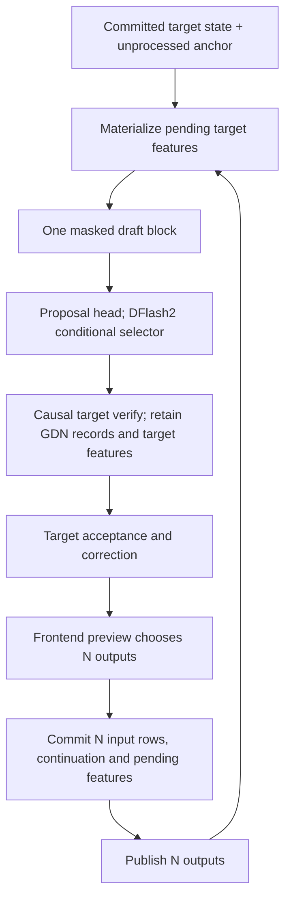

# DFlash and DFlash2

DFlash backends propose several tokens with one masked-block forward, conditioned on committed
target hidden features. The target verifies the proposal causally and remains the output authority.
NInfer implements DFlash and DFlash2 as optional components of the
[Qwen3.5 model](qwen3_5-model.md). Their private config and bindings select the stored weights;
startup chooses one backend, draft width and proposal head.

This reference owns model mathematics, proposal distributions and backend state. Scheduling,
publication and common transactions are defined by [Engine architecture](engine-architecture.md).

## Configuration and current geometries

Both draft configs use `model_type=qwen3` and identify `DFlashDraftModel` or `DFlash2DraftModel`.
They supply draft layer count, attention/FFN dimensions, norm epsilon, one-dimensional RoPE theta,
layer attention types, sliding window, target block IDs and mask token ID. DFlash2 also supplies
convolution tap/group dimensions and selector rank/top-k. The hidden width and embedding/output
semantics come from the target. Exact fields are parsed in
[`config.cpp`](../../src/models/qwen3_5/config.cpp).

| Quantity | Official 35B-A3B DFlash | Official 27B DFlash2 |
|---|---:|---:|
| Hidden width H | 2048 | 5120 |
| Draft layers | 6 | 5 |
| Intermediate width | 6144 | 17408 |
| Q heads / KV heads / head dimension | 32 / 8 / 128 | 32 / 8 / 128 |
| Target block IDs | `[1,6,11,16,22,27,32,37]` | `[5,19,33,47,61]` |
| Attention pattern | Five local layers, then one full layer | Five local layers |
| Sliding-window scalar S | 4096 | 2048 |
| Norm epsilon / RoPE theta | `1e-6` / `1e7` | `1e-6` / `1e7` |
| Dynamic convolution | — | Two taps, group width 16 |
| Candidate selector | Per-position argmax | Top-16 conditional path, rank 256 |

The current Engine accepts startup draft count K in `1..15` and concurrency B in `1..8`. The
physical block width is `W=K+1`, containing one anchor and K masks. K is a runtime choice, not a
weight dimension. Geometry representable in config still needs the actual native Op support;
for example, DFlash2's fused convolution, context materializer and selector implement the listed
27B geometry.

## Target conditioning and context

Let F be the target's processed-token frontier. The target has consumed positions `[0,F)` and
already selected the next token `a=x_F`, which is the unprocessed anchor. Before proposing, the
backend materializes any committed pending target features so its context also reaches F.

For each processed position t, let `r_t^l` be the complete residual output of zero-based target
block l, after both mixer and FFN residual additions. Conditioning is:

```text
s_t = concat(r_t^l for l in target_layer_ids, in recorded order)
c_t = plain_rmsnorm(W_feature s_t, context_norm)
plain_rmsnorm(x,w) = w * x / sqrt(mean(x^2) + eps)
```

The feature projection is bias-free. A hidden-state API that counts the embedding as boundary zero
would expose block l at boundary l+1; the stored IDs are block IDs. Features are captured before
the next block's input norm or final Text norm. Multimodal inputs use the same target residual
capture after Vision embedding replacement.

Each draft layer independently projects this common c_t into its context K/V:

```text
k_raw^l(t) = W_context_key^l c_t
k_ctx^l(t) = rope_1d(plain_head_rmsnorm(k_raw^l(t), key_norm^l), position=t)
v_ctx^l(t) = W_context_value^l c_t
```

Context prefill performs feature projection and these K/V projections. It does not run prompt
tokens through the draft residual/MLP stack. Context uses absolute scalar Text cache positions and
full-head split-half RoPE; it does not use the target's partial three-axis MRoPE.

Source K/V parameters are used for both query-block and context projections. Their logical roles
and Uses remain separate; the official recipes share compatible physical data. The representation
of one role can be selected independently of the other.

DFlash2's fused context materializer stores BF16 K and BF16 V (this fork's BF16 profile is
symmetric; V is not converted to FP16). Raw K has no
observable BF16 cast between projection and head normalization. This complete contract is in
[`context_kv_materialize.h`](../../include/ninfer/ops/context_kv_materialize.h). If a prefill chunk
exceeds the local ring capacity, only its final live window needs storage; the context frontier
still advances by the complete chunk.

## Query block and attention masks

The draft input is the target embedding of:

```text
absolute position   F       F+1       F+2       ...       F+K
input token         a       MASK      MASK                MASK
role                anchor  proposal  proposal            proposal
```

The anchor conditions the block but is not sampled from its draft output. Mask output i predicts
the token at the same absolute position, without the target causal LM's next-token shift. All
proposals come from this one forward.

Draft attention is non-causal over context and query-block K/V. For a local layer with scalar S:

```text
allowed(p_query, p_key) = abs(p_key - p_query) < S
```

Endpoints at distance S−1 are included; distance S is excluded. Populated sequence bounds clip
the symmetric interval. With a full left context and `p_query=F+i`, the row sees at most `S-1-i`
context positions, plus all W query rows for the supported widths. A full layer attends all
populated context and query rows. These masks are specified by
[`sliding_window_attention.h`](../../include/ninfer/ops/sliding_window_attention.h) and
[`softmax_attention.h`](../../include/ninfer/ops/softmax_attention.h).

## DFlash backbone and proposal

Each layer uses plain RMSNorm, full-head Q/K normalization and scalar RoPE:

```text
n = plain_rmsnorm(x, input_norm)
q = rope_1d(plain_head_rmsnorm(W_query n, query_norm), positions)
k = rope_1d(plain_head_rmsnorm(W_key n, key_norm), positions)
v = W_value n
a = attention(q, concat(K_ctx,k), concat(V_ctx,v), scale=1/sqrt(D), layer_mask)
y = x + W_output a
m = plain_rmsnorm(y, post_attention_norm)
x_next = y + W_down(SiLU(W_gate m) * (W_up m))
```

After final plain RMSNorm, the mask columns go through the selected proposal head. DFlash uses
per-column argmax, either over public vocabulary rows of the full Text head or over the indexed
proposal head followed by token-ID remapping. Thus its actual proposal q is a point mass, including
when target sampling uses positive temperature.

Changing W can change every proposal because attention is non-causal. A shorter block is not
required to match the prefix of a longer block.

## DFlash2 dynamic convolution

DFlash2 adds a dynamic grouped convolution around both attention and MLP. Each branch has input
and output sides, two taps and a group width of 16. For normalized branch input X, with
`X[b,i,g,j]`, `g=0..H/16-1`, `j=0..15`:

```text
delta = reshape(W_delta X, [B,W,2 sides,2 taps,H/16 groups])

Conv_s(X)[b,i,g,j]
  = (base[s,0,g,j] + delta[b,i,s,0,g]) * X[b,i,g,j]
  + 1{i>=1} * (base[s,1,g,j] + delta[b,i,s,1,g]) * X[b,i-1,g,j]
```

Base coefficients vary by channel; dynamic increments are shared by the 16 channels in a group.
Position zero has no preceding tap. The convolution has no history across requests or rounds.
The output side reuses the delta computed from that branch's normalized input, applying it to the
branch output rather than projecting delta again.

Each DFlash2 layer performs:

```text
n = plain_rmsnorm(x, input_norm)
(prepared_a, finish_delta_a) = attention_conv.prepare(n)
q, k, v = query_key_value(prepared_a)
q, k = plain_head_rmsnorm_and_rope(q, k, positions)
a = noncausal_attention(q, concat(K_ctx,k), concat(V_ctx,v), layer_mask)
y = x + attention_conv.finish(W_output a, finish_delta_a)

m = plain_rmsnorm(y, post_attention_norm)
(prepared_m, finish_delta_m) = mlp_conv.prepare(m)
z = W_down(SiLU(W_gate prepared_m) * (W_up prepared_m))
x_next = y + mlp_conv.finish(z, finish_delta_m)
```

The native fused prepare emits BF16 prepared input and BF16 finish delta. Internal normalized
input and projected coefficients are private intermediates; finish consumes the represented delta
from prepare. The contract is
[`dynamic_grouped_conv.h`](../../include/ninfer/ops/dynamic_grouped_conv.h). After all layers, final
plain RMSNorm produces mask hidden columns for the selector.

## DFlash2 candidate path

For each mask hidden h_i, the selected head produces stable top-16 unary scores u_i and global
token IDs C_i. An indexed proposal head remaps shortlist rows before codebook access. Unary top-16
selection does not apply target penalties, temperature or top-k/top-p/min-p.

Let predecessor/successor codebooks have shape `[vocab_size,R]` and the hidden projection have
shape `[R,H]`. The current selector receives its projected hidden g_i as BF16, candidate scores as
FP32 and codebooks as BF16. For predecessor candidate p and current candidate c:

```text
g_i = W_hidden h_i
pred_token(i,p) = anchor          if i=0
                  C_(i-1)[p]     otherwise
E_i[p,c] = u_i[c] + sum_r W_pred[pred_token(i,p),r] * g_i[r] * W_succ[C_i[c],r]
```

The path is a left-to-right conditional walk using the actual selected predecessor:

```text
temperature <= 0:
    j_i = lowest-rank argmax_c E_i[j_(i-1),c]
    q_i = one_hot(j_i)

temperature > 0:
    q_i[c] = softmax_c(E_i[j_(i-1),c] / temperature)
    j_i ~ q_i

d_(i+1) = C_i[j_i]
```

For i=0 every predecessor row refers to the anchor. This is a conditional walk, not global path
optimization. The Op retains the actual FP32 q_i and global candidate IDs for target correction.
It ignores other target sampling controls. The RNG key uses request seed, `F+i` and the distinct
DFlash2-proposal purpose; compact-batch row does not define random identity. Exact inputs,
tie-breaking and storage are in
[`candidate_selector.h`](../../include/ninfer/ops/candidate_selector.h).

## Target verification and committed prefix

For each request, let P be the number of proposals that can be verified this round, `0<=P<=K`,
and Q=P+1 the target's live input width. The physical allocation still has W columns:

```text
verify input       a       d_1     d_2       ...       d_P
input position     F       F+1     F+2                 F+P
target output      p_0     p_1     p_2                 p_P
predicts position  F+1     F+2     F+3                 F+P+1
```

Proposal d_(i+1) is checked against target p_i. Target distributions include the public vocabulary
mask and configured penalties/temperature/filters, with accepted proposal history added as the
scan advances. Greedy verification accepts the matching target-argmax prefix. At the first
mismatch it emits the target correction; all-accept emits the bonus from p_P.

For positive-temperature target sampling, use the actual proposal distribution:

```text
accept d_(i+1) with probability min(1, p_i[d_(i+1)] / q_i[d_(i+1)])
on rejection: r_i(v) = max(p_i(v) - q_i(v), 0)
              correction ~ r_i / sum_v r_i(v)
on all accept: bonus ~ p_P
```

DFlash q is one-hot; DFlash2 q is the retained conditional distribution. This preserves the
processed target distribution for the verify path. Different draft formats, shortlist heads or
block widths can change acceptance and throughput; their logits need not match one another.

### Live widths

The two backend implementations use different proposal extents near a request tail:

| Extent | DFlash | DFlash2 |
|---|---|---|
| Proposal attention/masked input | Q=P+1 live columns | All W=K+1 columns |
| Target attention and GDN | Q=P+1 live columns | Q=P+1 live columns |
| Candidate prefix checked | First P proposals | First P proposals with their actual q |

DFlash2 computes its configured W-column proposal even when only a prefix can be verified. Its
proposal-valid tensor and target-valid tensor have different meanings. Columns outside the
target live extent have no logical state effect. P=0 verifies only the anchor and selects a target
output.

### Publication and state alignment

If A proposals are accepted, target verification licenses
`y=[d_1,...,d_A,correction_or_bonus]`, with L=A+1 outputs. Frontend preview chooses the final prefix
length N, `0<=N<=L`, accounting for EOS, stop, budget and cancellation.

When N>0, the transaction commits N target input rows `[a,d_1,...,d_(N-1)]` and publishes N output
tokens `[y_1,...,y_N]`. Continuation hidden comes from verify column N−1, and y_N becomes the next
unprocessed anchor. Target KV, GDN Fold, generated-token counters and frontier advance together.
The Fold uses records from this physical verify block, not a separately recomputed numerical path.

The first N columns of captured target features become pending context work. Context may remain at
F while target state advances to F+N. Before the next proposal, or before retaining a checkpoint,
fork or Host replica, those features are materialized and context catches up. N=0 cancellation
commits no new state and releases the sequence; it does not undo earlier adopted commits.

## Backend storage and lifecycle

Local draft layers store K/V in cyclic rings; full draft layers use paged KV. A full pool exists
only when selected draft config has full-attention layers. The official DFlash2 instance therefore
has five local rings and no full draft pool. Its ring payload per state image is:

```text
5 layers * (2-byte K + 2-byte V) * 8 heads * 128 * 2048 = 40 MiB
```

For frontier F_ctx and ring capacity S, the live interval is `[max(0,F_ctx-S),F_ctx)`, and absolute
position p uses physical slot `p mod S`. Frontier and coverage are sequence metadata. Old bytes
outside the live interval are unreachable.

Query-block K/V, candidate paths, q, verify results and GDN records are round scratch. Pending
features survive commit until context catch-up, but are not checkpoint payload. Increasing K
expands these transient extents; it does not increase DFlash2's 40 MiB ring image or introduce
cross-round convolution history.

Device fork, turn checkpoints, Host replicas and restore carry the backend context together with
target state and continuation metadata. Their coverage must agree. These rules are shared with
[context scheduling](resource-scheduling-and-context-cache.md) and
[ReplaySSM](replayssm-gdn.md).

## Execution flow



The finite model implementation is in
[`execution/draft.cpp`](../../src/models/qwen3_5/execution/draft.cpp); storage is in
[`program/storage/draft_context.cpp`](../../src/models/qwen3_5/program/storage/draft_context.cpp).
Workspace planners and CUDA Graph profiles use the selected parameters and startup widths. Native
Ops retain their own format, shape, numerical and state-transition contracts.
