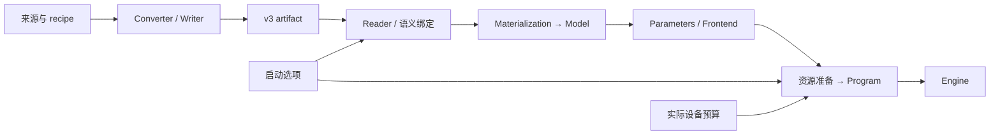

# NInfer Engine 架构

本文定义 NInfer 的模型实例、执行所有权与顶层控制面，说明权重如何进入固定模型实现，以及请求、
资源和输出如何共同提交。它是全局架构、请求生命周期和跨模块提交关系的维护者权威。

本文只规定长期稳定的边界：

- 谁拥有请求、顺序、缓存策略和物理状态；
- 架构代码、实例配置、权重表示与实际执行怎样相接；
- 请求在哪些稳定状态之间转换；
- 模型状态、输出状态和资源状态何时可以对外发布；
- cancellation 和 failure 如何到达唯一终态。

资源选择和上下文缓存策略由
[资源调度与上下文缓存](resource-scheduling-and-context-cache.md)定义；KV 的页、replica、block table
和 consumer contract 由 [Paged KV Context Store](paged-kv-cache.md)定义。

---

## 1. 产品执行模型

Generation purpose 的 NInfer Engine 固定运行：

- 一张 GPU；
- 一个常驻模型实例；
- 启动时确定的 `max_concurrency=1..8`；
- 一个有界 FIFO 等待队列；
- 不抢占已经激活的请求；
- 每个 decode round 将全部 decode-ready 请求组成一个紧凑批次。

Text、Vision、prefix reuse、MTP、DFlash/DFlash2、CLI 和 HTTP serving 都通过公共 `ninfer::Engine` 路径。
MTP、DFlash 和 DFlash2 是 Program 内部的执行后端，不产生第二套请求调度或结果发布机制。
Artifact 必须提供 Text；Vision、MTP、DFlash 和 DFlash2 的私有权重与资源可以缺省。
启动独立选择 Vision，以及 none 或一个 spec 后端，只为所选功能及其共享依赖绑定和准备资源。

同一个公共 Engine 还提供启动时固定的 CausalScoring purpose。它只服务离线文本评分：
`CausalScoreCore` 串行调用 Program，窗口使用临时的空 State 与 Main KV，不创建请求、continuation、
checkpoint 或 cache replica，也不进入 Scheduler/ResourceManager。Generation 与 CausalScoring
不在运行期切换，评分专用 staging 只在 CausalScoring 启动时分配。

`max_concurrency` 限制同时激活的请求数，不把共享 KV 容量平均切分给 lane。请求只有在 Program
证明其完整执行资源已经得到保障后才会进入 Active；进入 Active 后，它不会因为另一个请求或
inactive cache 的保留而丢失完成能力。

本文不覆盖多 GPU placement、active request preemption、priority/QoS、跨 Engine context store
或大规模 continuous batching。这些工作负载需要重新定义 admission 与公平性合同，不能直接从当前
小并发模型外推。

### 1.1 架构与权重实例

模型代码拥有数学公式、调用顺序、组件交接和状态转移。Config 提供层数、维度、Attention/GDN
分布和 expert 几何等实例参数。当前标准架构入口是 `Qwen3_5ForCausalLM` 与
`Qwen3_5MoeForCausalLM`；训练实例和物理权重分配作为数据进入对应实现。

V3 artifact 保存配置、物理对象、逻辑参数的 Binding、使用位置的 Use，以及 Frontend 资源。
Converter 负责源映射、量化或保值导入、融合存储、packing 和 layout 转换；loader 根据实际绑定
验证、读取并上传原字节。相同架构和可处理的配置更换训练权重或组合已有表示，沿用同一模型代码。



`metadata.name` 提供公开实例名称，缺省使用架构名称；服务可以用 `--model-id` 覆盖公开别名。
这些名称及转换 provenance 用于识别数据与来源。执行选择依据架构、配置和实际绑定。

文件及引用合同见[容器规范](artifact-container.md)，权重的数值解释与 planes 分别见
[数值格式](tensor-formats.md)和[存储布局](storage-layouts.md)。

---

## 2. 四个执行边界

请求路径只有四层：

```text
Gateway
  │ product/protocol input
  ▼
Frontend
  │ PreparedPrompt / OutputSession
  ▼
Engine
  │ request order / lifecycle / publication
  ▼
Program
    physical resources / model execution
```

### 2.1 Gateway

Gateway 是 CLI、HTTP server 或其他产品入口，拥有：

- 协议解析、连接和 streaming transport；
- message、tool、media 到公共输入的转换；
- URL、path 和 data acquisition；
- response schema、usage 和产品侧错误；
- Gateway 自身的并发与连接生命周期。

Gateway 不选择请求顺序、缓存来源、active lane 或 KV page。

### 2.2 Frontend

Frontend 拥有模型家族的输入与输出语义：

- tokenizer、chat template、Vision preprocessing 和 MRoPE prompt construction；
- owning `PreparedPrompt` 及其内容 identity；
- stop、thinking/content channel、detokenization、最终文本和模型私有结构化输出；
- model output 中可由历史 renderer 精确重建的 prefix-execution boundary；
- 每个请求独占的 `OutputSession`。

Frontend 可以预览一次模型输出将产生的语义效果，但只有 Engine 完成提交后才能发布该效果。
Frontend 不拥有等待队列、cache catalog 或物理模型状态。

### 2.3 Engine

Engine 是请求控制平面，拥有：

- outstanding capacity、FIFO queue 和 request deadline；
- request record、active slots、cancellation 和 response event；
- Scheduler 与 ResourceManager；
- admission、prefill、decode、control、capture 和 terminal 的编排；
- 模型提交、输出提交和 response publication 的顺序；
- Engine-wide failure cleanup；
- 可供 Gateway 读取的 Engine availability；其事实仍只由 EngineCore 的 failure/lifecycle 状态拥有。

Engine 理解请求、预算、finish reason 和可发布输出，不解释 transformer layer、KV plane 或 allocator。

### 2.4 Program

Program 是模型实例的物理执行入口，拥有：

- active sequence 与完整 continuation state；
- State/KV stores、allocator、replica、reference 和 reservation；
- prefill、ordinary decode、MTP/DFlash/DFlash2 和 forced control；
- provisional model state 及 accepted-prefix commit/rollback；
- resident prefix identity、shortlist digest 及 committed execution provenance；
- resource feasibility、物理 transition 和 `ResourceResult`；
- workspace、CUDA Graph 和固定模型调用；
- CausalScoring 窗口的临时 State/KV 与 `lm_head`/logprob staging。

Program 不维护 FIFO、SessionIndex、cache retention 价值或用户可见输出。

---

## 3. 唯一所有权

| 事实或决策 | 唯一所有者 |
|---|---|
| config、绑定、Use、权重 backing 与只读资源 | Model |
| 与绑定同源的原生执行参数 | ModelInstance 的 const Parameters；借用 Model |
| 协议、连接、transport | Gateway |
| prompt 与 output 语义 | Frontend |
| waiting queue、request record、response event | EngineCore |
| Engine availability | EngineCore；Gateway 只读取并映射为外部 readiness |
| FIFO head、backfill、prefill/decode 顺序、round membership | Scheduler |
| logical lane、cache catalog、session binding、retention policy | ResourceManager |
| model-output reconstruction-boundary 语义与 preview state | Frontend |
| committed resident prefix execution provenance | Program；Engine 只验证并搬运 metadata |
| physical State/KV、reservation、placement、model state | Program |

其他组件可以读取 owner 发布的稳定 summary，但不能复制一份可独立修改的同类状态。

### 3.1 Scheduler：只决定“谁在何时运行”

Scheduler 维护：

- 当前 FIFO head；
- staged-prefill owner；
- admission、prefill 与 decode 的公平门；
- 每轮紧凑执行成员；
- blocked head 的 backfill protection。

Scheduler 不读取 checkpoint payload、victim list、resource vector 或 allocator 状态。

### 3.2 ResourceManager：只决定“保留什么逻辑上下文”

ResourceManager 维护：

- logical lane 状态；
- private/shared checkpoint catalog；
- SessionIndex 与 prefix candidate index；
- retention class、命中观测和逻辑 claim；
- admission、capture 与 finish 的缓存策略。

它把请求和缓存候选交给 Program 评估，并采用 Program 返回的完整物理结果。它不维护一份
Device/Host bytes、page refcount 或 allocator free space 的镜像。

### 3.3 Program：只决定“物理上能否执行以及如何执行”

Program 中的真实 stores 与 allocators 是物理事实的唯一权威。Program：

- 从完整候选终态计算占用、共享、回收和阶段峰值；
- seal 与当前 `resource_revision` 绑定的 opaque `ResourcePlan`；
- 执行唯一的物理 transition；
- 返回足以让 ResourceManager 更新逻辑 catalog 的完整结果。

Program 不根据 session、FIFO 位置或用户身份决定缓存价值。

### 3.4 模型实例与 Engine lifetime

Engine 按标准架构/config 解释所选功能的逻辑需求，binder 将它们对应到 artifact 的对象与 Use。
Materializer 建立稳定 backing 并上传原字节，得到只读 Model。ModelInstance 持有 Model，
从它形成 const Parameters，并将已解析的 tokenizer 等只读资源交给 Frontend。

Planner 与实际执行借用同一 Parameters。Planner 根据启动范围查询各层及所选后端的需求，
建立容量曲线；结合权重驻留后的 Device 余量解析 KV 容量，再构造 Program 的最终布局。
GenerationCore 或 CausalScoreCore 在实例准备完成后使用它。

模型配置、绑定和权重地址在实例存活期间固定；每个 Program 独占自己的可变 State/KV、
workspace 和 Graph。销毁时先结束 Engine core 和未决设备工作，再销毁实例的 Program、
Frontend 和 Parameters，最后释放 Model backing。Reader 与上传 staging 属于加载生命周期。

权重、State/KV backing、block-table matrices、workspace 与 CUDA Graph resources 在 Engine 开始接受请求前
建立。运行期改变 ownership、mapping、frontier 与 replica placement，但不重建这些大块 Device allocations。

### 3.5 固定执行与原生参数

逻辑参数、物理对象和 Op 参数数量分别由数学、存储和实际入口决定。例如当前 Dense Attention
投影的两种已实现写法：

| 实际绑定 | 固定模型调用 |
|---|---|
| 一个 Q4 parent 保存 Q/K，另一个 Q5 parent 保存 gate/V | 准备两个权重参数，使用双权重投影入口 |
| 一个完整 FP8 或 NVFP4 parent 按顺序保存 Q/K/gate/V | 准备一个权重参数，使用单权重投影入口 |

View 保留完整 parent 的几何、planes 和元素范围；原生准备按入口要求解释这些引用。
共享对象只驻留一次，各使用位置保留独立的 Use。激活许可为 `A16Only={A16}`、
`AllowA8={A16,A8}`、`AllowA4={A16,A8,A4}`；融合调用取相关 Use 的许可交集并处理所需辅助值。

模型代码直接维护有限调用写法、跨 Op 融合和阶段关系；闭合计算及其 shape/格式分派属于 Op。
Reader、binder、原生参数准备、容量查询、warmup 和实际执行各自检查所消费的合同。
合法 artifact 的可执行范围取决于实际消费者，转换不要求完整权重组合预先注册。

数学公式、权重表示值和实现精度分别解释。不同量化、prefill、batch 或 speculative 路线可以
产生不同结果；数值与状态正确性按[Op 合同](op-development.md)及对应的独立 oracle 验证。

---

## 4. 请求与资源生命周期

### 4.1 Request 状态

请求沿以下稳定状态前进：

```text
Waiting
  -> Materializing
  -> Prefill
  -> DecodeReady | ControlReady
  -> TerminalPending
  -> Finished
```

- **Waiting**：只有 owning prompt 和输出状态，没有 Program sequence。
- **Materializing**：资源 transition 已取得逻辑 claim；source 在 commit 或 abort 前仍有效。
- **Prefill**：请求已经 Active，正在消费 prompt suffix。
- **DecodeReady**：可加入下一次紧凑 decode round。
- **ControlReady**：Frontend 要求提交规范的 forced-control suffix。
- **TerminalPending**：模型执行已经终止，但 active resources 尚未完成 retain 或 release。
- **Finished**：资源与输出均已提交，response 可以完成。

### 4.2 Logical lane 状态

ResourceManager 的 lane 状态是：

```text
Free -> Materializing -> Active -> TerminalPending -> Free
```

请求只有在 materialization 的物理结果和逻辑结果均成功采用后才能进入 Active。Terminal request
必须保留 active ownership，直到完整 checkpoint 被发布或全部 active resources 被释放。
Streaming request 在 admission 选择提交后、任何输出 delta 前发布一次 `GenerationStart`；其中的
prompt token 和 reused-prefix token 是已提交的资源选择事实，不等待 prefill 完成。

Control lane、StateImage slot、KV execution row 和 decode batch row 是不同身份：

- lane 是 Engine 的长期 active request 位置；
- State/KV execution resource 由 Program 分配；
- compact row 只是当前 GPU unit 的序号。

它们不得互相推导所有权。

### 4.3 Gateway 与 Engine capacity

Gateway 可以在 prepare 或 media acquisition 前取得自己的 request lifetime。Engine outstanding capacity
从非零输出请求成功 submit 开始，由两个独立事实共同释放：

```text
response_done       worker 已形成最终 result 或 error
consumer_released   wait 已结束，或 GenerationHandle 被放弃

release_capacity =
    response_done && consumer_released && !capacity_released
```

两者可以任意先后，但 capacity 只释放一次。请求句柄被放弃只设置 cancellation 和
`consumer_released`，不会从 consumer thread 调用 Program。

### 4.4 Continuation 与 session

Active continuation 是可写的模型状态；published checkpoint 是不可变的可复用状态。一个可复用
checkpoint 必须证明同一 frontier 上的完整 State、Main KV、selected backend KV 和继续执行所需
metadata。

Session key 只是查找提示，不拥有 continuation。每个请求进入 Engine 时取得单调的
`publication_order`；只有更新顺序更晚的完成结果才能替换 SessionIndex binding。

---

## 5. Worker 与调度

### 5.1 单一 mutation owner

只有 Engine worker 修改 request record、Scheduler、ResourceManager 和 Program。Ingress、consumer
和 transport thread 通过队列、cancellation flag 与 response event 交互，不直接改变模型状态。

一个 worker boundary 按语义顺序处理：

1. 接收等待请求的 timeout 或 cancellation；
2. 推进已经开始的 resource transition；
3. 完成可以结算的 TerminalPending 请求；
4. 冻结 active cancellation snapshot；
5. 在公平门允许时尝试一次 admission；
6. 选择 staged prefill、forced control 或紧凑 decode；
7. 运行至多一个模型 execution unit；
8. 提交模型、预算和 Frontend 输出状态；
9. 发布 response event 与观测。

具体循环拆分可以变化，但以下顺序不能变化：

- in-flight GPU unit 必须先到稳定边界，再修改其资源映射；
- Program commit 必须先于用户输出发布；
- resource result 必须先被采用，lane 才能改变可见状态；
- 一个 global resource topology transition 未结算时，不启动另一个 transition。

### 5.2 Admission 顺序

Scheduler 先确定唯一可尝试的 waiting request，ResourceManager 再为它选择缓存与资源终态。
资源条件不能反向改变 FIFO 所有权。

FIFO head 暂时受 active incumbents 阻塞时，Scheduler 记录 protected head 和必须结束的 donor set。
后续请求只有在 Program 证明以下条件时才能 backfill：

> borrower 持续占用其完整 active reservation 后，既定 donor set 结束仍足以让 head 以
> root 且释放全部 inactive cache 的方案进入。

这个证明不使用“borrower 预计先完成”的时间假设。改变全局资源拓扑的 transition 会推进
`resource_revision`，之后的 backfill 必须重新证明。

### 5.3 Prefill 与 decode

Scheduler 保证：

- 同时最多一个 staged-prefill request；
- 已有 decode work 不会被连续 prefill 饿死；
- decode round 包含所有且仅包含当前 decode-ready requests；
- batch 使用精确 `B`，不以 inactive lane padding 到 `max_concurrency`。

Program 接收紧凑的 `SequenceHandle[B]` 和每行预算。Prefix reuse 只减少 materialization 或 suffix
prefill，不创建另一条调度路径。

### 5.4 Admission invalidation

只有会改变 admission 结论的事实才重新触发检查：

- waiting queue 或 FIFO head 变化；
- lane 释放；
- staged-prefill gate 变化；
- resource transition 到达终态；
- Program 的全局资源 revision 变化。

普通 decode frontier 推进、输出发布和统计更新不扫描 cache catalog，也不重复运行 pressure planner。

---

## 6. 两类提交事务

Engine 跨模块编排两类互不替代的事务。

### 6.1 Resource transition

Resource transition 在以下边界改变全局资源或 ownership：

- waiting request materialization；
- active checkpoint capture；
- terminal retain 或 release；
- inactive checkpoint 的 placement 或删除。

需要 planning、allocation 或 transfer 的路径遵循：

```text
logical choice
  -> Program seals ResourcePlan
  -> RunningTransaction
  -> ResourceResult
  -> ResourceManager adopts result
```

`ResourcePlan` 与 Program 的 `resource_revision` 绑定。Start 前过期的 plan 可以无副作用地重新规划；
start 后不能更换 source、victim 或 stage 顺序。Abort 也必须返回完整终态，使所有 claim、pin 和已提交
的安全降级得到唯一解释。

资源候选、可行性公式、成本模型和有界搜索由
[资源调度与上下文缓存](resource-scheduling-and-context-cache.md)定义。

### 6.2 Model-unit transaction

Prefill finalization、decode 和 control execution 可以产生 move-only `PendingBatch`：

```text
frozen sequence membership
provisional tokens
per-row produced extent
per-row accepted-prefix execution metadata
Program-owned provisional state
```

Engine 对每行输出进行 Frontend preview，形成 accepted-prefix decision，再用一次
`Program::commit` 或 `Program::abort_pending` 消费整个 batch。Program 同时提交或回滚该 prefix
对应的 Main/backend KV、recurrent state、RNG 和 speculative state。

非取消行遵循：

```text
1 <= accepted_tokens <= produced_tokens
nonterminal -> accepted_tokens == produced_tokens
terminal    -> accepted_tokens may be a produced prefix
```

取消行使用零 accepted token 并进入 terminal。Engine 不允许逐行遗弃一个仍未消费的
`PendingBatch`。

### 6.3 输出发布顺序

一次模型输出的可见顺序是：

```text
Frontend preview
  -> Program commits accepted model state and resident prefix execution provenance
  -> terminal resource result, when required
  -> generation budget and scheduler accounting
  -> OutputSession commits preview
  -> publish stream/aggregate event
```

因此 consumer 不会看到尚未提交的 token，也不会看到与 Program frontier 不一致的 continuation。
Forced control 使用同一提交顺序，但 token 由 Frontend 提供，不调用 sampler，也不推进 sampling RNG。

Frontend 产生的 boundary metadata 只描述当前 accepted span 内的相对位置。Engine 验证它落在该 span 内并随
对应 row 搬运，不解释 delimiter，也不修改 resident identity。Program 使用 pending row 的 base frontier
转换为绝对位置，并与 accepted token、Main/backend state 及 prefix digest 原子提交。Program commit 失败时，
`OutputSession` 的 preview state 同样不提交；ordinary、MTP、DFlash 和 forced control 共享这一所有权链。

---

## 7. Terminal、cancellation 与 failure

### 7.1 Terminal

成功终止的 Active request 先进入 TerminalPending：

```text
choose retain or release
  -> Program publishes one complete checkpoint or releases the sequence
  -> ResourceManager adopts the terminal result
  -> optional SessionIndex update
  -> lane becomes Free
```

Checkpoint 的逻辑 publication slot 在 activation 时已经保留。若 retention 无法形成完整 continuation，
确定性终态是 release，而不是让请求停留在 TerminalPending。

### 7.2 Cancellation

Cancellation 在 Engine worker 的稳定边界生效：

| 观察到 cancellation 时的状态 | 结果 |
|---|---|
| Waiting | 不创建 Program state，直接结束请求 |
| Materializing | abort resource transition，并采用其完整结果 |
| Active | 当前 GPU unit 稳定后进入 TerminalPending 并 release |
| PendingBatch | 通过 cancelled row decision 提交或整体 abort |
| 已 commit、尚未 adopt | 先 adopt 已提交结果，再执行 terminal 路径 |

Cancellation 不修改 in-flight mapping，也不从未完成的 active state 发布 checkpoint。

### 7.3 Request-local rejection

在 Program mutation 前可以只拒绝当前请求：

- queue timeout、overload 或 waiting cancellation；
- 输入超过公开 context contract；
- prompt 或 generation request 无法表示；
- 即使采用 root source 并释放全部 inactive cache，单请求仍不可行。

### 7.4 Engine-wide failure

以下情况说明共享物理状态已无法安全解释，必须使整个 Engine 失败：

- GPU mutation 后既不能 commit 也不能形成稳定 abort；
- `PendingBatch` membership 或 disposition 不一致；
- handle owner/generation 不匹配；
- resource、checkpoint completeness 或 noexcept adoption invariant 被破坏。

Cleanup 顺序必须先终止 Program 中未决的 resource/model transaction，再释放 active state，最后清空
ResourceManager 与完成所有 request response。内部不变量错误不能降级成 cache miss、等待或重试。

---

## 8. 物理执行的顶层约束

以下约束属于 Engine 架构，但具体实现由 Program 和下层文档定义：

- Program 在启动时建立固定数量的 control/state/table resources；
- growing KV 由共享 paged pools 支持，active request 持有完整增长 reservation；
- 一个 GPU execution unit 内 State/KV mapping 保持稳定；
- CUDA Graph 按合法 exact-`B` topology 建立，request identity 和 page IDs 是稳定输入数据，不是 graph key；
- ordinary decode 不运行 catalog scan、pressure search 或后台 replica scan；
- workspace 是 Program 启动时统一规划的 backing，Vision、Text 和 speculative schedule 按互斥 lifetime
  使用其内部区域。

容量查询消费与执行同源的逐层参数和 Use。Allocation scope 同时用于布局计算与实际执行；
顺序互斥的 scratch 取峰值，跨阶段仍活跃的数据计入完整存活期。Vision handoff 保留至 Text
及所选 MTP 的最后消费者，speculative pending features 和 verify records 保留至对应提交边界。

Prefill 成本按硬件类别与实际 Text/Vision 配置、绑定、Use 派生的 `prefill_signature` 选择测量值，
没有匹配值时使用通用成本。成本用于规划选择，物理可行性仍由 Program 的实际布局与占用决定。

Serve warmup 使用同一个公共 Engine 执行路径，但其 request-level context cache 固定关闭。Warmup 可以建立
CUDA Graph、library 和 allocator 的运行时状态，结束后不得留下可供外部请求命中的 continuation 或占用
checkpoint catalog。

---

## 9. 核心不变量

1. 请求顺序只由 Scheduler 决定。
2. logical cache policy 只由 ResourceManager 决定。
3. physical occupancy、reservation、feasibility 和 model state 只由 Program 决定。
4. Active publication 前必须具备完整 continuation 和完成 reservation。
5. 一个 global resource topology transition 在任意时刻至多一个。
6. 一个 `PendingBatch` 必须由一次 Program commit 或 abort 完整消费。
7. Program、Frontend 和 budget 均提交后，模型输出才对 consumer 可见。
8. TerminalPending 结束前不得释放或复用该请求的 active ownership。
9. Cancellation 只能在线性化的 worker boundary 改变请求状态。
10. 每个 accepted request、resource transaction 和 model transaction 都有有限且唯一的终态。

---

## 10. 实现位置与相邻权威

| 职责 | 主要位置 |
|---|---|
| 公共 Engine facade | `include/ninfer/engine.h`, `src/runtime/engine/engine.cpp` |
| Engine worker 与 request lifecycle | `src/runtime/engine/engine_core.h`, `src/runtime/engine/request_record.h` |
| Scheduler | `src/runtime/engine/scheduler.h`, `admission_policy.*` |
| 实例构造与有效期 | `src/runtime/engine/model_instance.*` |
| ResourceManager 与 materialization planner | `src/runtime/engine/context_cache/` |
| 请求、执行、资源与计时合同 | `src/runtime/contract/` |
| 模型 config、绑定与只读数据 | `src/models/qwen3_5/config.*`, `load/`, `model.*` |
| 原生参数与固定模型调用 | `src/models/qwen3_5/execution/` |
| Program 规划、存储与事务 | `src/models/qwen3_5/program/` |
| Frontend 与模型状态布局 | `src/models/qwen3_5/frontend/`, `state/` |
| device primitives, tensors/views, checked layouts, arenas, graph RAII, physical KV, raw transfers | `src/core/` |
| generic `.ninfer` framing, descriptors, binding primitives, materialization | `src/artifact/` |
| semantic Ops | `src/ops/`, `include/ninfer/ops/` |
| shared JSON/message-to-owning-input adapter | `src/product/prompt_input/` |
| media URL/path/data acquisition | `src/product/media_acquire/`, CLI and serving |
| media decode from already-owned bytes | `src/media/decode/` |
| HTTP Gateway | `src/serve/` |
| 源适配、recipe 与转换方法 | `tools/convert/` |
| Python 容器读取、编码输出与 writer | `tools/artifact/` |

这些路径用于定位当前 authority，不把文件拆分固化为外部接口。

`include/ninfer/engine.h` 与 `include/ninfer/types.h` 是 in-tree application 使用的 opaque Engine
interface 和 owning host values；NInfer 当前不安装或导出 C++ SDK。`include/ninfer/ops/` 是
repository-internal semantic Op contracts。`.ninfer` 是唯一 C++ 产品 artifact，不通过扩展名检测、
兼容 shim 或第二套产品入口加载其他格式。CLI、server 和 inference benchmark 只通过公共 Engine
推理；converter 不提供 Python model-inference route。

Artifact 层拥有通用文件与驻留合同，模型实现拥有数学及状态操作，runtime 拥有公共运行合同与
Engine 发布政策，product/serving 拥有输入获取及协议翻译。每个语义闭合的 Op（包括 fused、
fixed-shape 和 device-specialized 实现）都归 `src/ops`。

相邻文档：

- [资源调度与上下文缓存](resource-scheduling-and-context-cache.md)：resource vector、checkpoint
  capability、pressure planning 和 physical transition；
- [Paged KV Context Store](paged-kv-cache.md)：typed pools、logical pages、replicas、block tables
  和 consumer address contract；
- [Op development](op-development.md)：Op 正确性与性能准入；
- [CLI](../cli.md)与 [HTTP serving](../serving.md)：外部行为。
