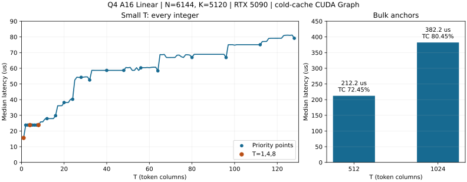

# Q4 Linear 性能报告：N=6144，K=5120

2026-09-15 测量。本文记录当前实现的完整 Linear Op 性能，供评估该 shape 和后续调优参考。

## 测量对象与条件

| 项目 | 本次测量 |
|---|---|
| 权重 | `Q4_G64_FP16`，row-split layout；每 64 个权重共享一个 FP16 scale |
| 数学形状 | `W[6144,5120] × X[5120,T] → Y[6144,T]` |
| 输入、输出与 policy | BF16 输入、BF16 输出，`A16Only` |
| GPU / 工具链 | NVIDIA GeForce RTX 5090；CUDA 13.1，Release，`sm_120a` |
| 计时入口 | `ninfer::ops::linear`；每个 CUDA Graph 包含一次完整 Op 调用 |
| cache / 采样 | 每个样本前清除 256 MiB L2；5 次 warmup、50 次测量，报告 median |
| 输入 fixture | 使用公开 bench 的 Q4 packed-weight 和 BF16 activation fixture；数值验证另用非均匀权重与 scale |
| 覆盖 | T=1～128 每个整数；512、1024 两个大 T 锚点；另测部分区间交界 |

当前被测调用均只有一个 Graph kernel 节点，外部 workspace 为零。测量范围是纯 Linear Op。

## 最终耗时曲线



左图包含全部 128 个实测点，圆点标出重点 T，橙色强调 T=1、4、8。
右图分别展示 512、1024；图中的 TC 百分比采用下文的逻辑算力口径。
图中连线仅连接相邻实测点，重点点位及额外交界点的数据见下文。

## 逻辑带宽与 Tensor Core 利用率

权重包含 `6144 × 5120 / 64 × 34 = 16,711,680` 字节的 code 和 scale。
沿用 [Linear bench 指标定义](../linear-benchmark.md#5-数学工作量与-route-neutral-指标)：

```text
model_bytes = 16,711,680 + 2 × 5120 × T + 2 × 6144 × T
逻辑带宽 GB/s = model_bytes / seconds / 1e9
带宽利用率 = 逻辑带宽 / 1792 GB/s × 100%

有效算力 TFLOP/s = 2 × 6144 × 5120 × T / seconds / 1e12
TC 利用率 = 有效算力 / 209.5 TFLOP/s × 100%
```

分母取自 bench 的 RTX 5090 固定规格常量。T=1 使用 GEMV，TC 利用率填 `—`；
T≥2 的最终路径均使用 BF16 输入、FP32 累加的 dense MMA，使用对应的 **209.5 TFLOP/s** 峰值。
Q4 权重格式不改变这个峰值的精度归属。当前 bench 的 Q4 行未填充 TC 字段，本文按上述公式
补算；不加入解码、padding 或额外 tile 工作量。

这些百分比衡量完成逻辑工作量的效率。大 T 下逻辑带宽百分比下降，不单独作为访存效率不足的判断。
T=1 的逻辑带宽为 **1071.6 GB/s，标称带宽利用率 59.80%**；若采用 bench 另列的
1674.5 GB/s 实测持续读上限，则为 **64.00%**，对应 bench 的 `READ_%` 口径。

| T | 延迟 µs | 逻辑带宽 GB/s | 带宽利用率 | 有效算力 TFLOP/s | TC 利用率 |
|---:|---:|---:|---:|---:|---:|
| 1 | 15.616 | 1071.6 | 59.80% | 4.03 | — |
| 2 | 23.808 | 703.8 | 39.28% | 5.29 | 2.52% |
| 3 | 23.808 | 704.8 | 39.33% | 7.93 | 3.78% |
| 4 | 23.808 | 705.7 | 39.38% | 10.57 | 5.05% |
| 5 | 23.808 | 706.7 | 39.43% | 13.21 | 6.31% |
| 6 | 23.808 | 707.6 | 39.49% | 15.86 | 7.57% |
| 7 | 23.808 | 708.6 | 39.54% | 18.50 | 8.83% |
| 8 | 23.840 | 708.6 | 39.54% | 21.11 | 10.08% |
| 12 | 27.904 | 608.6 | 33.96% | 27.06 | 12.91% |
| 16 | 29.792 | 573.0 | 31.98% | 33.79 | 16.13% |
| 20 | 38.176 | 449.6 | 25.09% | 32.96 | 15.73% |
| 24 | 40.224 | 428.9 | 23.93% | 37.54 | 17.92% |
| 28 | 54.240 | 319.7 | 17.84% | 32.48 | 15.50% |
| 32 | 52.512 | 332.0 | 18.53% | 38.34 | 18.30% |
| 40 | 58.656 | 300.3 | 16.76% | 42.90 | 20.48% |
| 48 | 58.656 | 303.3 | 16.93% | 51.48 | 24.58% |
| 56 | 60.288 | 298.1 | 16.64% | 58.44 | 27.89% |
| 64 | 58.368 | 311.0 | 17.36% | 68.99 | 32.93% |
| 80 | 66.880 | 276.8 | 15.45% | 75.26 | 35.92% |
| 96 | 66.848 | 282.3 | 15.76% | 90.35 | 43.13% |
| 112 | 75.040 | 256.3 | 14.30% | 93.90 | 44.82% |
| 128 | 79.136 | 247.6 | 13.82% | 101.76 | 48.57% |
| 512 | 212.224 | 133.1 | 7.43% | 151.78 | 72.45% |
| 1024 | 382.240 | 104.1 | 5.81% | 168.54 | 80.45% |

## 曲线解读与验证

[shape 实现](../../../src/ops/linear/q4/shapes/n6144_k5120.cu) 使用 GEMV、K-split 容量和分块 MMA：

- T=1 的 GEMV 为 15.616µs；T=2 为 23.808µs，是小 T 图中最大的相邻涨幅（52.46%）。
  两者采用不同的计算组织，当前保留了更低延迟的单 token 专用路径。
- T=2～24 采用容量 8、16、24 的 K-split。跨容量时会出现额外列计算的台阶；
  T=25 起进入分块 MMA，T=24 的 40.224µs 上升到 T=25 的 52.480µs。
- T=25～96 使用 32×32 输出 tile；T=97～192 使用 32×64。
  T=96、97 分别为 66.848、75.008µs。
  完整 tile、尾列和 CTA 数量变化仍使曲线出现台阶，调优并不要求每个 T 单独特化。
- T=385～640 使用 64×64 输出 tile，其他更大区间使用 64×128。
  T=512 为 **212.224µs、151.78 TFLOP/s、72.45% TC 利用率**；
  T=1024 为 **382.240µs、168.54 TFLOP/s、80.45% TC 利用率**。
  额外测得 T=384/385 为 130.304/187.488µs，T=640/641 为 251.200/271.648µs。

T=1 的带宽效率和 T=512 的 TC 效率仍留有研究空间；当前数据不把剩余百分比直接解释为可追回的时间。
较小 T 的 TC 百分比也不能单独说明实现优劣，需要结合其延迟、逻辑流量及并行规模判断。

`ninfer_linear_q4_a16_test` 已通过。测试独立解码 packed Q4 code 与 FP16 scale，以 FP64
矩阵乘法为 oracle，使用现有 A16 误差标准。该 shape 覆盖完整输出检查、容量与 MMA 分界、
512/1024 及邻点、输出 guard、输入保持，以及改变输入后的 CUDA Graph 重放。
数值检查不要求不同计算组织产生相同结果。共享 MMA launcher 的整理同时经过完整 Q4 测试集。

## 复现

```bash
cmake --build build -j --target ninfer_linear_bench ninfer_linear_q4_a16_test
./build/tests/ninfer_linear_q4_a16_test

./build/bench/ninfer_linear_bench \
  --qtype q4 --policy a16 --n 6144 --k 5120 \
  --sweep 1:128 --execution graph --warmup 5 --repeat 50 --flush-mib 256 \
  --csv-out profiles/bench/q4_n6144_k5120/final_graph.csv
./build/bench/ninfer_linear_bench \
  --qtype q4 --policy a16 --n 6144 --k 5120 \
  --sweep 512:1024:512 --execution graph --warmup 5 --repeat 50 --flush-mib 256 \
  --csv-out profiles/bench/q4_n6144_k5120/final_bulk.csv
```

继续调优时，按 [Linear 调优与报告规范](../linear-tuning.md) 选择候选、
验证数值并收敛分派；本报告提供最终实现的测量结果与曲线，不承诺这些参数适用于其他 shape。
